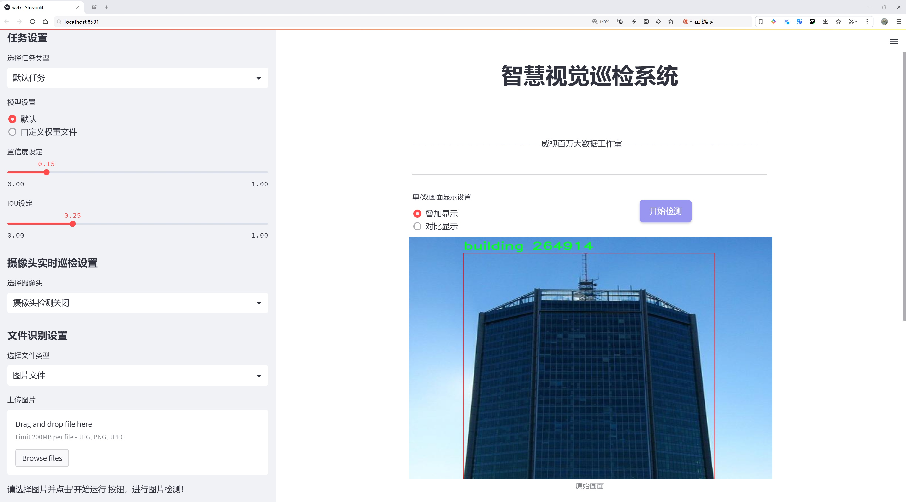
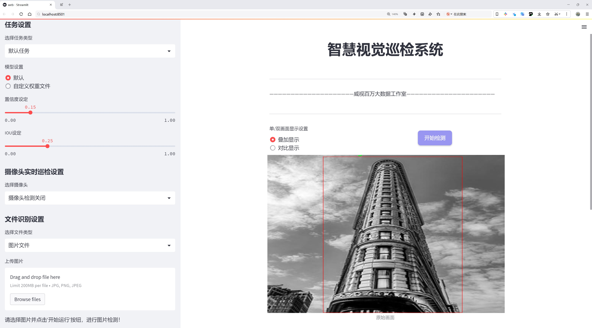
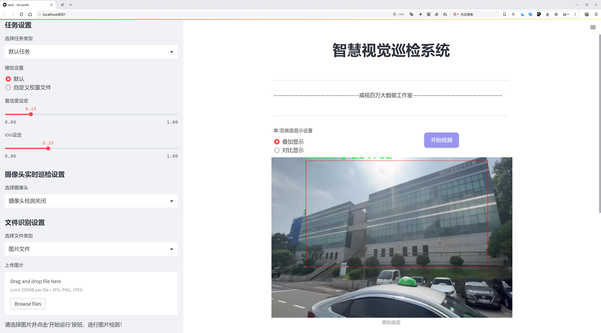
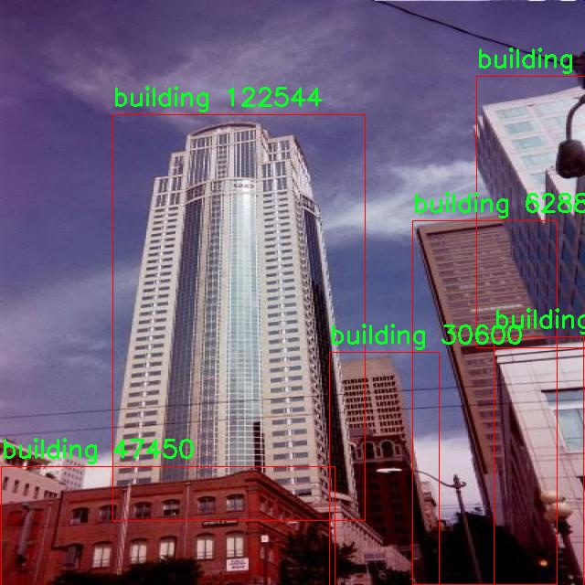
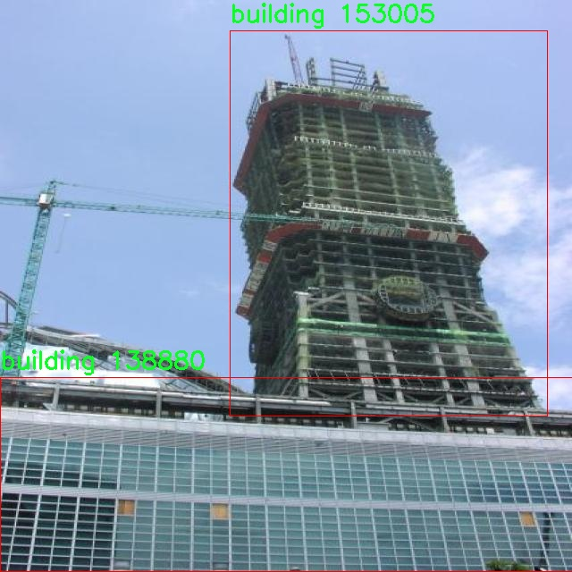
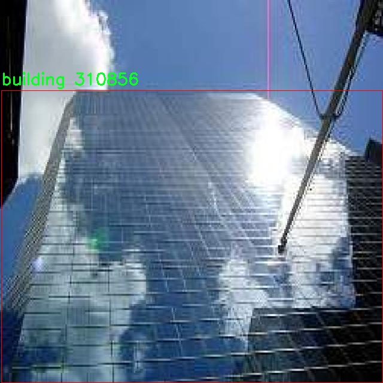
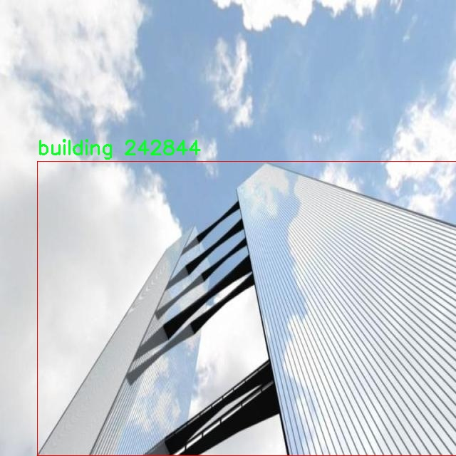

# 建筑物检测检测系统源码分享
 # [一条龙教学YOLOV8标注好的数据集一键训练_70+全套改进创新点发刊_Web前端展示]

### 1.研究背景与意义

项目参考[AAAI Association for the Advancement of Artificial Intelligence](https://gitee.com/qunshansj/projects)

项目来源[AACV Association for the Advancement of Computer Vision](https://gitee.com/qunmasj/projects)

研究背景与意义

随着城市化进程的加快，建筑物的数量和种类日益增多，建筑物检测在城市管理、环境监测和灾害评估等领域的重要性愈发凸显。建筑物检测不仅涉及到建筑物的数量统计，还包括对建筑物类型、形态及其空间分布的分析。这些信息对于城市规划、基础设施建设以及资源配置具有重要的指导意义。然而，传统的建筑物检测方法往往依赖于人工标注和手工特征提取，效率低下且易受人为因素影响。因此，基于深度学习的自动化建筑物检测系统应运而生，成为解决这一问题的有效途径。

YOLO（You Only Look Once）系列模型因其高效的实时检测能力而受到广泛关注。特别是YOLOv8，作为YOLO系列的最新版本，其在准确性和速度上都取得了显著的提升。通过改进YOLOv8，我们可以更好地适应建筑物检测的需求，尤其是在复杂城市环境中，建筑物的形态多样性和遮挡现象使得检测任务更加困难。因此，基于改进YOLOv8的建筑物检测系统，不仅能够提高检测的准确性，还能在实时性上满足实际应用的需求。

本研究所使用的数据集包含2000张图像，涵盖48个建筑物类别。这一丰富的数据集为模型的训练和评估提供了坚实的基础。数据集中的多样性使得模型能够学习到不同类型建筑物的特征，从而提升其泛化能力。通过对这些数据的深入分析，我们能够识别出建筑物的多样性和复杂性，进而优化模型的设计和参数设置。此外，数据集中包含的不同类别建筑物，能够帮助我们在不同场景下进行更为精确的检测，推动建筑物检测技术的进一步发展。

在实际应用中，基于改进YOLOv8的建筑物检测系统将为城市管理者提供重要的数据支持，帮助他们更好地进行城市规划和资源配置。同时，该系统也可以应用于灾害监测与评估，通过快速识别受灾建筑物的情况，为救援工作提供及时的信息。此外，该系统在智能交通、无人机巡检等领域也具有广泛的应用前景。

综上所述，基于改进YOLOv8的建筑物检测系统的研究，不仅具有重要的理论意义，还具有广泛的实际应用价值。通过提升建筑物检测的自动化水平，我们能够更好地应对城市化带来的挑战，为实现智能城市的愿景贡献力量。

### 2.图片演示







##### 注意：由于此博客编辑较早，上面“2.图片演示”和“3.视频演示”展示的系统图片或者视频可能为老版本，新版本在老版本的基础上升级如下：（实际效果以升级的新版本为准）

  （1）适配了YOLOV8的“目标检测”模型和“实例分割”模型，通过加载相应的权重（.pt）文件即可自适应加载模型。

  （2）支持“图片识别”、“视频识别”、“摄像头实时识别”三种识别模式。

  （3）支持“图片识别”、“视频识别”、“摄像头实时识别”三种识别结果保存导出，解决手动导出（容易卡顿出现爆内存）存在的问题，识别完自动保存结果并导出到tempDir中。

  （4）支持Web前端系统中的标题、背景图等自定义修改，后面提供修改教程。

  另外本项目提供训练的数据集和训练教程,暂不提供权重文件（best.pt）,需要您按照教程进行训练后实现图片演示和Web前端界面演示的效果。

### 3.视频演示

[3.1 视频演示](https://www.bilibili.com/video/BV1Er4neSELB/)

### 4.数据集信息展示

##### 4.1 本项目数据集详细数据（类别数＆类别名）

nc: 1
names: ['building']


##### 4.2 本项目数据集信息介绍

数据集信息展示

在本研究中，我们采用了名为“Building detection”的数据集，以支持对YOLOv8建筑物检测系统的改进和优化。该数据集专注于建筑物的识别与定位，具有明确的目标和应用场景，旨在提升计算机视觉领域中建筑物检测的准确性和效率。数据集的类别数量为1，具体类别为“building”，这表明该数据集专注于单一类型的目标检测，旨在为建筑物的识别提供高质量的标注数据。

“Building detection”数据集的构建经过精心设计，涵盖了多种建筑物的图像，确保了数据的多样性和代表性。数据集中包含的图像来源广泛，涵盖了城市、乡村、商业区和住宅区等不同环境中的建筑物。这种多样性不仅提高了模型的泛化能力，也为后续的建筑物检测任务提供了坚实的基础。每张图像都经过专业的标注，确保建筑物的边界框准确无误，便于模型学习和训练。

在数据集的标注过程中，采用了严格的质量控制措施，以确保每个样本的标注都符合高标准。这种高质量的标注数据对于深度学习模型的训练至关重要，因为模型的性能往往依赖于训练数据的质量和数量。通过使用该数据集，我们能够有效地训练YOLOv8模型，使其在建筑物检测任务中达到更高的准确率和召回率。

此外，数据集的设计还考虑到了不同光照条件、天气变化和视角差异对建筑物检测的影响。数据集中包含的图像在不同的时间段和气候条件下拍摄，涵盖了晴天、阴天、雨天等多种场景。这种设计使得模型在实际应用中能够更好地适应各种环境，提高了模型的鲁棒性。

在训练过程中，我们将“Building detection”数据集分为训练集和验证集，以便对模型的性能进行评估和调优。训练集用于模型的学习，而验证集则用于监测模型在未见数据上的表现，确保模型不仅能够在训练数据上取得良好效果，同时也能在实际应用中保持高效的检测能力。

总之，“Building detection”数据集为本研究提供了一个坚实的基础，支持我们在YOLOv8建筑物检测系统的改进过程中进行深入的实验和分析。通过对该数据集的充分利用，我们期望能够实现建筑物检测的精确化和智能化，为城市规划、环境监测以及相关领域的研究提供有力的技术支持。随着数据集的不断扩展和模型的持续优化，我们相信建筑物检测技术将在未来取得更大的突破和应用。










### 5.全套项目环境部署视频教程（零基础手把手教学）

[5.1 环境部署教程链接（零基础手把手教学）](https://www.ixigua.com/7404473917358506534?logTag=c807d0cbc21c0ef59de5)


[5.2 安装Python虚拟环境创建和依赖库安装视频教程链接（零基础手把手教学）](https://www.ixigua.com/7404474678003106304?logTag=1f1041108cd1f708b01a)

### 6.手把手YOLOV8训练视频教程（零基础小白有手就能学会）

[6.1 手把手YOLOV8训练视频教程（零基础小白有手就能学会）](https://www.ixigua.com/7404477157818401292?logTag=d31a2dfd1983c9668658)

### 7.70+种全套YOLOV8创新点代码加载调参视频教程（一键加载写好的改进模型的配置文件）

[7.1 70+种全套YOLOV8创新点代码加载调参视频教程（一键加载写好的改进模型的配置文件）](https://www.ixigua.com/7404478314661806627?logTag=29066f8288e3f4eea3a4)

### 8.70+种全套YOLOV8创新点原理讲解（非科班也可以轻松写刊发刊，V10版本正在科研待更新）

由于篇幅限制，每个创新点的具体原理讲解就不一一展开，具体见下列网址中的创新点对应子项目的技术原理博客网址【Blog】：


[8.1 70+种全套YOLOV8创新点原理讲解链接](https://gitee.com/qunmasj/good)

### 9.系统功能展示（检测对象为举例，实际内容以本项目数据集为准）

图9.1.系统支持检测结果表格显示

  图9.2.系统支持置信度和IOU阈值手动调节

  图9.3.系统支持自定义加载权重文件best.pt(需要你通过步骤5中训练获得)

  图9.4.系统支持摄像头实时识别

  图9.5.系统支持图片识别

  图9.6.系统支持视频识别

  图9.7.系统支持识别结果文件自动保存

  图9.8.系统支持Excel导出检测结果数据


### 10.原始YOLOV8算法原理

原始YOLOv8算法原理

YOLOv8作为YOLO系列中的一员，继承并发展了前几代模型的优点，尤其是在目标检测的精度和速度上实现了显著的提升。该算法的设计理念围绕着实时性和高效性展开，旨在为各种应用场景提供灵活的解决方案。YOLOv8提供了五种不同规模的模型（n、s、m、l、x），每种模型在深度、特征图宽度和通道数上进行了精心设计，以适应不同的计算资源和任务需求。特别是YOLOv8n模型，作为原始算法的代表，展示了YOLOv8在轻量化和高效性方面的优势。

YOLOv8的网络结构主要由输入端、主干网络和检测端三个部分组成。输入端负责对输入图像进行预处理，包括Mosaic数据增强、自适应图像缩放和灰度填充等操作。这些预处理步骤旨在提高模型对多样化数据的适应能力，从而增强模型的泛化性能。主干网络则是YOLOv8的核心，采用了卷积、池化等操作来提取图像特征。与前几代YOLO模型相比，YOLOv8在主干网络中引入了C2f模块，这一模块结合了C3模块和ELAN模块的设计思想，增加了更多的残差连接，确保了在轻量化的基础上能够获取更加丰富的梯度信息。

在检测端，YOLOv8引入了当前流行的解耦合头结构，将分类和检测过程分开进行，这一创新使得模型在处理复杂场景时能够更为高效。传统的anchor-based方法在小目标检测上常常面临挑战，而YOLOv8则采用了anchor-free的方法，这不仅提高了检测精度，还加快了检测速度。通过将Anchor-Based替换为Anchor-Free，YOLOv8能够更好地适应小目标的检测需求，尤其是在复杂背景下的目标识别。

YOLOv8在训练过程中也进行了多项创新。数据增强策略上，YOLOv8在训练的最后10个epoch中关闭了马赛克增强，结合动态Task-Aligned Assigner样本分配策略，使得模型在训练时能够更有效地学习到有用的特征。此外，YOLOv8在损失计算方面也进行了优化，采用了BCELoss作为分类损失，DFLLoss和CIoULoss作为回归损失，这一组合不仅提高了模型的收敛速度，还增强了模型在复杂场景下的鲁棒性。

值得注意的是，YOLOv8在设计时充分考虑了小目标检测的难点。在复杂的水面环境中，小目标漂浮物的特征往往复杂多变，背景也极为多样化，传统的YOLO模型在此类场景下容易出现定位误差和目标感知能力不足的问题。为了解决这些问题，YOLOv8通过引入BiFormer双层路由注意力机制构建C2fBF模块，保留了特征提取过程中更细粒度的上下文信息，进一步提升了模型对小目标的感知能力。此外，YOLOv8还在Neck端引入了GSConv和Slim-neck技术，旨在保持检测精度的同时降低计算量，确保模型在实时应用中的高效性。

总的来说，YOLOv8通过多项创新和优化，在目标检测领域树立了新的标杆。其轻量化设计、解耦合结构以及针对小目标的改进，使得YOLOv8在多种应用场景中表现出色。无论是在复杂的背景下，还是在小目标的检测任务中，YOLOv8都展现出了其强大的适应能力和优越的性能，为目标检测技术的发展提供了新的思路和方向。随着YOLOv8的广泛应用，未来在智能监控、自动驾驶、无人机等领域的应用潜力也将不断被挖掘和拓展。


### 11.项目核心源码讲解（再也不用担心看不懂代码逻辑）

#### 11.1 70+种YOLOv8算法改进源码大全和调试加载训练教程（非必要）\ultralytics\models\sam\modules\transformer.py

以下是经过简化和注释的核心代码，保留了主要功能并对每个部分进行了详细的中文注释：

```python
import math
import torch
from torch import Tensor, nn
from typing import Tuple, Type

class TwoWayTransformer(nn.Module):
    """
    双向变换器模块，能够同时关注图像和查询点。用于目标检测、图像分割等任务。
    """

    def __init__(self, depth: int, embedding_dim: int, num_heads: int, mlp_dim: int, activation: Type[nn.Module] = nn.ReLU) -> None:
        """
        初始化双向变换器。

        Args:
          depth (int): 变换器的层数
          embedding_dim (int): 输入嵌入的通道维度
          num_heads (int): 多头注意力的头数
          mlp_dim (int): MLP块的内部通道维度
        """
        super().__init__()
        self.layers = nn.ModuleList([TwoWayAttentionBlock(embedding_dim, num_heads, mlp_dim, activation) for _ in range(depth)])
        self.final_attn = Attention(embedding_dim, num_heads)
        self.norm_final_attn = nn.LayerNorm(embedding_dim)

    def forward(self, image_embedding: Tensor, point_embedding: Tensor) -> Tuple[Tensor, Tensor]:
        """
        前向传播，处理图像嵌入和查询点嵌入。

        Args:
          image_embedding (Tensor): 图像嵌入
          point_embedding (Tensor): 查询点嵌入

        Returns:
          Tuple[Tensor, Tensor]: 处理后的查询点嵌入和图像嵌入
        """
        # 将图像嵌入展平并转置
        image_embedding = image_embedding.flatten(2).permute(0, 2, 1)

        # 逐层应用变换器块
        queries = point_embedding
        for layer in self.layers:
            queries, image_embedding = layer(queries, image_embedding)

        # 最终注意力层
        attn_out = self.final_attn(queries, image_embedding)
        queries = self.norm_final_attn(queries + attn_out)

        return queries, image_embedding


class TwoWayAttentionBlock(nn.Module):
    """
    双向注意力块，执行自注意力和交叉注意力。
    """

    def __init__(self, embedding_dim: int, num_heads: int, mlp_dim: int = 2048, activation: Type[nn.Module] = nn.ReLU) -> None:
        """
        初始化双向注意力块。

        Args:
          embedding_dim (int): 嵌入的通道维度
          num_heads (int): 注意力头的数量
          mlp_dim (int): MLP块的隐藏维度
        """
        super().__init__()
        self.self_attn = Attention(embedding_dim, num_heads)
        self.cross_attn = Attention(embedding_dim, num_heads)
        self.mlp = MLPBlock(embedding_dim, mlp_dim, activation)

    def forward(self, queries: Tensor, keys: Tensor) -> Tuple[Tensor, Tensor]:
        """应用自注意力和交叉注意力，并返回处理后的嵌入。"""
        # 自注意力
        attn_out = self.self_attn(queries, queries, queries)
        queries = queries + attn_out

        # 交叉注意力
        attn_out = self.cross_attn(queries, keys, keys)
        queries = queries + attn_out

        # MLP块
        mlp_out = self.mlp(queries)
        queries = queries + mlp_out

        return queries, keys


class Attention(nn.Module):
    """注意力层，允许在投影到查询、键和值后进行下采样。"""

    def __init__(self, embedding_dim: int, num_heads: int) -> None:
        """
        初始化注意力层。

        Args:
            embedding_dim (int): 输入嵌入的维度。
            num_heads (int): 注意力头的数量。
        """
        super().__init__()
        self.q_proj = nn.Linear(embedding_dim, embedding_dim)
        self.k_proj = nn.Linear(embedding_dim, embedding_dim)
        self.v_proj = nn.Linear(embedding_dim, embedding_dim)

    def forward(self, q: Tensor, k: Tensor, v: Tensor) -> Tensor:
        """计算给定查询、键和值的注意力输出。"""
        q = self.q_proj(q)
        k = self.k_proj(k)
        v = self.v_proj(v)

        attn = torch.softmax(q @ k.transpose(-2, -1) / math.sqrt(k.size(-1)), dim=-1)
        return attn @ v
```

### 代码注释说明：
1. **TwoWayTransformer**: 这是一个双向变换器的实现，包含多个注意力块。它的主要功能是通过查询点对图像进行注意力计算。
2. **TwoWayAttentionBlock**: 这个类实现了一个注意力块，包含自注意力和交叉注意力的计算。它通过MLP块进一步处理查询。
3. **Attention**: 这是一个基本的注意力层，负责将输入的查询、键和值进行线性变换并计算注意力权重。

通过这些注释，可以更好地理解每个类和方法的功能及其在整个模型中的作用。

这个文件定义了一个名为 `TwoWayTransformer` 的神经网络模块，主要用于处理图像和查询点之间的双向注意力机制。该模块特别适用于目标检测、图像分割和点云处理等任务。以下是对代码的详细分析。

首先，`TwoWayTransformer` 类继承自 `nn.Module`，其构造函数接收多个参数，包括变换器的层数（`depth`）、输入嵌入的通道维度（`embedding_dim`）、多头注意力的头数（`num_heads`）、MLP块的内部通道维度（`mlp_dim`）以及激活函数等。构造函数中创建了一个 `ModuleList`，用于存储多个 `TwoWayAttentionBlock` 层，这些层会在前向传播中依次应用。

在 `forward` 方法中，输入的图像嵌入和位置编码被展平并转置，以便适应后续的注意力计算。然后，方法准备查询（`queries`）和键（`keys`），并通过所有的注意力层进行处理。最后，应用一个最终的注意力层将查询点与图像嵌入进行结合，并进行层归一化处理。

`TwoWayAttentionBlock` 类实现了一个注意力块，能够同时进行自注意力和交叉注意力。它包含四个主要层：自注意力层、从查询到图像的交叉注意力层、MLP块和从图像到查询的交叉注意力层。构造函数中初始化了这些层，并设置了是否跳过第一层的位置信息编码。

在 `forward` 方法中，首先对查询进行自注意力处理，然后进行交叉注意力处理，接着通过 MLP 块进行变换，最后再次进行交叉注意力处理，返回处理后的查询和键。

`Attention` 类实现了一个基本的注意力机制，允许在投影到查询、键和值之后对嵌入进行下采样。构造函数中初始化了输入嵌入的维度、注意力头的数量以及下采样率。`forward` 方法计算注意力输出，首先对输入进行线性投影，然后将其分离为多个注意力头，计算注意力权重，并最终组合回单个输出。

整体来看，这个模块通过双向注意力机制有效地结合了图像信息和查询点信息，能够在多种视觉任务中发挥重要作用。通过灵活的层设计和注意力机制，它能够处理复杂的输入并提取有用的特征。

#### 11.2 70+种YOLOv8算法改进源码大全和调试加载训练教程（非必要）\ultralytics\engine\exporter.py

以下是经过简化和注释的代码，保留了最核心的部分，主要是与YOLOv8模型导出相关的功能。

```python
import json
import os
import shutil
import subprocess
import time
import warnings
from copy import deepcopy
from datetime import datetime
from pathlib import Path

import numpy as np
import torch

from ultralytics.cfg import get_cfg
from ultralytics.utils import LOGGER, __version__, yaml_save
from ultralytics.utils.checks import check_requirements
from ultralytics.utils.torch_utils import select_device

class Exporter:
    """
    导出模型的类，支持多种格式的导出。
    """

    def __init__(self, cfg='default_cfg.yaml', overrides=None):
        """
        初始化Exporter类。

        参数:
            cfg (str): 配置文件路径，默认为'default_cfg.yaml'。
            overrides (dict): 配置覆盖项，默认为None。
        """
        self.args = get_cfg(cfg, overrides)  # 获取配置
        self.callbacks = []  # 初始化回调列表

    def __call__(self, model=None):
        """执行导出操作并返回导出文件列表。"""
        t = time.time()  # 记录开始时间
        fmt = self.args.format.lower()  # 获取导出格式并转为小写
        self.device = select_device('cpu' if self.args.device is None else self.args.device)  # 选择设备

        # 检查模型类名和输入尺寸
        model.names = check_class_names(model.names)
        self.imgsz = check_imgsz(self.args.imgsz, stride=model.stride, min_dim=2)

        # 创建输入张量
        im = torch.zeros(self.args.batch, 3, *self.imgsz).to(self.device)

        # 深拷贝模型并设置为评估模式
        model = deepcopy(model).to(self.device)
        model.eval()

        # 执行一次前向推理以初始化模型
        _ = model(im)

        # 导出模型
        f = self.export_onnx(model, im)  # 仅导出ONNX格式
        LOGGER.info(f'导出完成，文件保存在: {f}，耗时: {time.time() - t:.2f}s')
        return f  # 返回导出文件路径

    def export_onnx(self, model, im):
        """导出ONNX格式的模型。"""
        import onnx  # 导入ONNX库

        f = Path("model.onnx")  # 设置导出文件名
        torch.onnx.export(
            model.cpu(),  # 将模型移至CPU
            im.cpu(),  # 将输入移至CPU
            f,  # 导出文件路径
            opset_version=12,  # ONNX操作集版本
            input_names=['images'],  # 输入名称
            output_names=['output0'],  # 输出名称
            dynamic_axes={'images': {0: 'batch', 2: 'height', 3: 'width'}}  # 动态轴
        )

        # 检查导出的ONNX模型
        model_onnx = onnx.load(f)  # 加载ONNX模型
        onnx.checker.check_model(model_onnx)  # 检查模型有效性

        return str(f)  # 返回导出文件路径

# 示例用法
# exporter = Exporter(cfg='path/to/config.yaml')
# exported_file = exporter(model)  # 假设model是已加载的YOLO模型
```

### 代码注释说明：
1. **类和方法定义**：`Exporter`类用于处理模型的导出，包含初始化和导出方法。
2. **初始化方法**：通过配置文件和覆盖项初始化导出器，设置设备。
3. **调用方法**：执行导出操作，记录时间，选择设备，检查模型和输入尺寸，执行前向推理。
4. **导出ONNX方法**：使用PyTorch的`torch.onnx.export`函数导出模型为ONNX格式，并进行有效性检查。

以上代码简化了原始代码的复杂性，保留了核心的导出功能，并提供了详细的中文注释以帮助理解。

这个程序文件是用于将YOLOv8模型导出为多种格式的工具，主要使用Python编写，并依赖于PyTorch等深度学习框架。文件中包含了导出不同格式模型的相关函数和类，支持的格式包括PyTorch、TorchScript、ONNX、OpenVINO、TensorRT、CoreML、TensorFlow等。

文件的开头部分提供了支持的导出格式的概述，包括每种格式的命令行参数和生成的模型文件名。用户可以通过Python代码或命令行接口（CLI）调用导出功能，具体的命令和代码示例也在注释中列出。

在实现上，文件首先导入了必要的库和模块，包括处理文件路径、时间、深度学习模型的相关模块等。接着定义了一些辅助函数，例如`export_formats`用于返回支持的导出格式，`gd_outputs`用于获取TensorFlow GraphDef模型的输出节点名称。

`try_export`是一个装饰器，用于捕获导出过程中的异常并记录日志。接下来，`Exporter`类是核心部分，负责模型的导出工作。它的构造函数接收配置参数，并根据这些参数设置导出格式和其他选项。

`__call__`方法是`Exporter`类的主要入口，执行导出过程。它首先运行导出开始的回调函数，然后根据指定的格式进行相应的模型导出。模型的输入、输出形状和元数据也在此过程中进行设置和记录。

类中还定义了多个导出方法，例如`export_torchscript`、`export_onnx`、`export_openvino`等，每个方法负责将模型导出为特定格式，并在导出过程中记录相关信息和元数据。

在导出过程中，程序会进行一系列的检查，包括设备选择、模型参数设置、输入输出形状验证等，确保导出过程顺利进行。导出完成后，程序会记录导出结果，并提供后续的预测和验证命令。

总的来说，这个文件提供了一个灵活且功能强大的接口，允许用户将YOLOv8模型导出为多种格式，以便在不同的环境和平台上进行部署和使用。

#### 11.3 ui.py

```python
import sys
import subprocess

def run_script(script_path):
    """
    使用当前 Python 环境运行指定的脚本。

    Args:
        script_path (str): 要运行的脚本路径

    Returns:
        None
    """
    # 获取当前 Python 解释器的路径
    python_path = sys.executable

    # 构建运行命令
    command = f'"{python_path}" -m streamlit run "{script_path}"'

    # 执行命令
    result = subprocess.run(command, shell=True)
    if result.returncode != 0:
        print("脚本运行出错。")


# 实例化并运行应用
if __name__ == "__main__":
    # 指定您的脚本路径
    script_path = "web.py"  # 这里可以直接指定脚本名，假设它在当前目录下

    # 运行脚本
    run_script(script_path)
```

### 代码核心部分及注释：

1. **导入必要的模块**：
   - `sys`：用于访问与 Python 解释器相关的变量和函数。
   - `subprocess`：用于创建新进程、连接到它们的输入/输出/错误管道，并获得返回码。

2. **定义 `run_script` 函数**：
   - 该函数接收一个脚本路径作为参数，并使用当前 Python 环境来运行该脚本。

3. **获取当前 Python 解释器的路径**：
   - `python_path = sys.executable`：获取当前正在使用的 Python 解释器的完整路径。

4. **构建运行命令**：
   - `command = f'"{python_path}" -m streamlit run "{script_path}"'`：构建一个命令字符串，用于运行指定的脚本。这里使用了 `streamlit` 模块来运行 Python 脚本。

5. **执行命令**：
   - `result = subprocess.run(command, shell=True)`：使用 `subprocess.run` 方法执行构建的命令。`shell=True` 允许在 shell 中执行命令。

6. **检查脚本运行结果**：
   - `if result.returncode != 0:`：检查返回码，如果不为 0，表示脚本运行出错，打印错误信息。

7. **主程序入口**：
   - `if __name__ == "__main__":`：确保只有在直接运行该脚本时才会执行以下代码。
   - `script_path = "web.py"`：指定要运行的脚本路径。
   - `run_script(script_path)`：调用 `run_script` 函数来执行指定的脚本。

这个程序文件的主要功能是使用当前的 Python 环境来运行一个指定的脚本，具体来说是运行一个名为 `web.py` 的脚本。程序首先导入了必要的模块，包括 `sys`、`os` 和 `subprocess`，这些模块提供了与系统交互和执行外部命令的功能。此外，还导入了 `abs_path` 函数，这个函数可能用于获取脚本的绝对路径。

在 `run_script` 函数中，首先获取当前 Python 解释器的路径，使用 `sys.executable` 来实现。接着，构建一个命令字符串，这个命令将会使用 `streamlit` 来运行指定的脚本。命令的格式是 `"{python_path}" -m streamlit run "{script_path}"`，其中 `python_path` 是当前 Python 解释器的路径，`script_path` 是要运行的脚本的路径。

然后，使用 `subprocess.run` 函数来执行这个命令。这个函数会在一个新的 shell 中运行命令，并等待命令执行完成。如果命令执行的返回码不为 0，表示脚本运行出错，程序会打印出相应的错误信息。

在文件的最后部分，使用 `if __name__ == "__main__":` 语句来确保只有在直接运行这个文件时才会执行后面的代码。在这里，首先调用 `abs_path` 函数来获取 `web.py` 的绝对路径，并将其赋值给 `script_path` 变量。最后，调用 `run_script` 函数来运行这个脚本。

总体来说，这个程序的功能是封装了一个简单的命令行工具，用于方便地运行一个特定的 Python 脚本，并处理可能出现的错误。

#### 11.4 70+种YOLOv8算法改进源码大全和调试加载训练教程（非必要）\ultralytics\models\fastsam\prompt.py

以下是代码中最核心的部分，并附上详细的中文注释：

```python
import os
import numpy as np
import torch
from PIL import Image
import cv2
from ultralytics.utils import TQDM

class FastSAMPrompt:
    """
    Fast Segment Anything Model 类，用于图像标注和可视化。

    属性:
        device (str): 计算设备（'cuda' 或 'cpu'）。
        results: 目标检测或分割结果。
        source: 源图像或图像路径。
        clip: 用于线性分配的 CLIP 模型。
    """

    def __init__(self, source, results, device='cuda') -> None:
        """初始化 FastSAMPrompt，接受源图像、结果和设备，并为线性分配分配 CLIP 模型。"""
        self.device = device
        self.results = results
        self.source = source

        # 导入并分配 CLIP 模型
        try:
            import clip  # 用于线性分配
        except ImportError:
            from ultralytics.utils.checks import check_requirements
            check_requirements('git+https://github.com/openai/CLIP.git')
            import clip
        self.clip = clip

    @staticmethod
    def _format_results(result, filter=0):
        """将检测结果格式化为包含 ID、分割、边界框、分数和面积的注释列表。"""
        annotations = []
        n = len(result.masks.data) if result.masks is not None else 0
        for i in range(n):
            mask = result.masks.data[i] == 1.0
            if torch.sum(mask) >= filter:
                annotation = {
                    'id': i,
                    'segmentation': mask.cpu().numpy(),
                    'bbox': result.boxes.data[i],
                    'score': result.boxes.conf[i]}
                annotation['area'] = annotation['segmentation'].sum()
                annotations.append(annotation)
        return annotations

    @torch.no_grad()
    def retrieve(self, model, preprocess, elements, search_text: str, device) -> int:
        """处理图像和文本，计算相似度，并返回 softmax 分数。"""
        preprocessed_images = [preprocess(image).to(device) for image in elements]
        tokenized_text = self.clip.tokenize([search_text]).to(device)
        stacked_images = torch.stack(preprocessed_images)
        image_features = model.encode_image(stacked_images)
        text_features = model.encode_text(tokenized_text)
        image_features /= image_features.norm(dim=-1, keepdim=True)
        text_features /= text_features.norm(dim=-1, keepdim=True)
        probs = 100.0 * image_features @ text_features.T
        return probs[:, 0].softmax(dim=0)

    def text_prompt(self, text):
        """处理文本提示，将其应用于现有结果并返回更新后的结果。"""
        if self.results[0].masks is not None:
            format_results = self._format_results(self.results[0], 0)
            cropped_boxes, cropped_images, not_crop, filter_id, annotations = self._crop_image(format_results)
            clip_model, preprocess = self.clip.load('ViT-B/32', device=self.device)
            scores = self.retrieve(clip_model, preprocess, cropped_boxes, text, device=self.device)
            max_idx = scores.argsort()[-1]  # 获取最大分数的索引
            max_idx += sum(np.array(filter_id) <= int(max_idx))  # 处理过滤的索引
            self.results[0].masks.data = torch.tensor(np.array([ann['segmentation'] for ann in annotations]))
        return self.results

    def _crop_image(self, format_results):
        """根据提供的注释格式裁剪图像，并返回裁剪的图像和相关数据。"""
        if os.path.isdir(self.source):
            raise ValueError(f"'{self.source}' 是一个目录，不是此函数的有效源。")
        image = Image.fromarray(cv2.cvtColor(self.results[0].orig_img, cv2.COLOR_BGR2RGB))
        ori_w, ori_h = image.size
        annotations = format_results
        mask_h, mask_w = annotations[0]['segmentation'].shape
        if ori_w != mask_w or ori_h != mask_h:
            image = image.resize((mask_w, mask_h))
        cropped_boxes = []
        cropped_images = []
        not_crop = []
        filter_id = []
        for _, mask in enumerate(annotations):
            if np.sum(mask['segmentation']) <= 100:
                filter_id.append(_)
                continue
            bbox = self._get_bbox_from_mask(mask['segmentation'])  # 获取 mask 的边界框
            cropped_boxes.append(self._segment_image(image, bbox))  # 保存裁剪的图像
            cropped_images.append(bbox)  # 保存裁剪的图像的边界框

        return cropped_boxes, cropped_images, not_crop, filter_id, annotations

    @staticmethod
    def _get_bbox_from_mask(mask):
        """从 mask 中获取边界框，应用形态学变换并返回边界框坐标。"""
        mask = mask.astype(np.uint8)
        contours, _ = cv2.findContours(mask, cv2.RETR_EXTERNAL, cv2.CHAIN_APPROX_SIMPLE)
        x1, y1, w, h = cv2.boundingRect(contours[0])
        x2, y2 = x1 + w, y1 + h
        if len(contours) > 1:
            for b in contours:
                x_t, y_t, w_t, h_t = cv2.boundingRect(b)
                x1 = min(x1, x_t)
                y1 = min(y1, y_t)
                x2 = max(x2, x_t + w_t)
                y2 = max(y2, y_t + h_t)
        return [x1, y1, x2, y2]
```

### 代码说明：
1. **类定义**：`FastSAMPrompt` 类用于图像的快速分割和标注，包含了图像处理、结果格式化、CLIP 模型的使用等功能。
2. **初始化方法**：在初始化时，指定源图像、检测结果和计算设备（如 GPU 或 CPU），并导入 CLIP 模型。
3. **结果格式化**：`_format_results` 方法将检测结果格式化为包含 ID、分割掩码、边界框、分数和面积的注释列表。
4. **检索功能**：`retrieve` 方法处理图像和文本，计算它们之间的相似度，并返回 softmax 分数。
5. **文本提示**：`text_prompt` 方法处理文本提示，将其应用于当前的分割结果，并返回更新后的结果。
6. **图像裁剪**：`_crop_image` 方法根据分割结果裁剪图像，并返回裁剪后的图像和相关数据。
7. **边界框获取**：`_get_bbox_from_mask` 方法从分割掩码中提取边界框的坐标。

以上是代码的核心部分和详细注释，便于理解其功能和实现逻辑。

这个程序文件定义了一个名为 `FastSAMPrompt` 的类，主要用于图像注释和可视化，结合了图像分割和文本提示的功能。该类包含多个方法，旨在处理图像、提取分割结果、绘制注释、以及根据用户输入的文本、点或框进行交互式修改。

在初始化方法 `__init__` 中，类接受三个参数：源图像、检测结果和计算设备（默认为 'cuda'）。它还尝试导入 CLIP 模型，以便在后续处理中进行线性分配。

`_segment_image` 方法用于根据给定的边界框坐标对图像进行分割，生成一个透明背景的图像。`_format_results` 方法将检测结果格式化为包含 ID、分割掩码、边界框、置信度和面积的注释列表。`_get_bbox_from_mask` 方法通过形态学变换提取掩码的边界框。

`plot` 方法用于在图像上绘制注释、边界框和点，并将结果保存到指定的输出目录。该方法使用了 `TQDM` 进行进度条显示，并支持多种可选参数以调整绘图效果。

`fast_show_mask` 方法快速显示掩码注释，支持随机颜色和透明度设置，并可以绘制边界框和点。`retrieve` 方法则处理图像和文本，计算相似度并返回 softmax 分数。

`_crop_image` 方法根据提供的注释格式裁剪图像，并返回裁剪后的图像和相关数据。`box_prompt` 和 `point_prompt` 方法分别根据用户输入的边界框和点对检测结果进行调整，计算 IoU（交并比）并更新掩码数据。

`text_prompt` 方法处理文本提示，将其应用于现有结果并返回更新后的结果。最后，`everything_prompt` 方法返回处理后的结果，方便用户获取最终的分割结果。

总体而言，这个类提供了一种灵活的方式来处理图像分割任务，允许用户通过不同的输入方式（文本、点、框）来修改和优化分割结果，适用于各种计算机视觉应用。

#### 11.5 70+种YOLOv8算法改进源码大全和调试加载训练教程（非必要）\ultralytics\nn\__init__.py

```python
# 导入必要的模型和函数
from .tasks import (BaseModel, ClassificationModel, DetectionModel, SegmentationModel, 
                    attempt_load_one_weight, attempt_load_weights, guess_model_scale, 
                    guess_model_task, parse_model, torch_safe_load, yaml_model_load)

# 定义模块的公开接口
__all__ = (
    'attempt_load_one_weight',  # 尝试加载单个权重文件的函数
    'attempt_load_weights',      # 尝试加载多个权重文件的函数
    'parse_model',               # 解析模型结构的函数
    'yaml_model_load',           # 从YAML文件加载模型的函数
    'guess_model_task',          # 猜测模型任务类型的函数
    'guess_model_scale',         # 猜测模型规模的函数
    'torch_safe_load',           # 安全加载PyTorch模型的函数
    'DetectionModel',            # 检测模型类
    'SegmentationModel',         # 分割模型类
    'ClassificationModel',       # 分类模型类
    'BaseModel'                  # 基础模型类
)
```

### 代码详细注释：

1. **导入模块**：
   - 通过 `from .tasks import ...` 导入了多个模型类和函数，这些都是与模型相关的核心功能。
   - 具体导入的内容包括基础模型类（`BaseModel`）、分类模型（`ClassificationModel`）、检测模型（`DetectionModel`）、分割模型（`SegmentationModel`）以及一些辅助函数（如加载权重、解析模型等）。

2. **定义公开接口**：
   - `__all__` 是一个特殊变量，用于定义当使用 `from module import *` 时，哪些名称会被导入。
   - 这里列出了所有希望对外公开的函数和类，确保用户在使用该模块时能够方便地访问这些核心功能。
   - 每个函数和类的注释简要说明了其功能，便于理解其用途。

这个程序文件是Ultralytics YOLO（You Only Look Once）系列模型的一个初始化模块，遵循AGPL-3.0许可证。文件中主要导入了一些与模型相关的类和函数，这些类和函数用于构建和加载不同类型的YOLO模型。

首先，文件通过`from .tasks import ...`语句导入了多个组件，包括基础模型（BaseModel）、分类模型（ClassificationModel）、检测模型（DetectionModel）、分割模型（SegmentationModel）等。这些模型类是YOLO框架的核心部分，分别用于不同的任务，如图像分类、目标检测和图像分割。

此外，文件还导入了一些辅助函数，如`attempt_load_one_weight`和`attempt_load_weights`，这些函数用于加载模型权重，确保模型在训练或推理时能够使用预训练的参数。`guess_model_scale`和`guess_model_task`则用于推测模型的规模和任务类型，帮助用户更好地选择合适的模型配置。

`parse_model`和`yaml_model_load`函数用于解析模型结构和从YAML文件加载模型配置，这对于构建和定制模型非常重要。最后，`torch_safe_load`是一个用于安全加载PyTorch模型的函数，确保在加载过程中不会出现错误。

在文件的最后，使用`__all__`定义了一个公共接口，列出了该模块中可以被外部访问的所有组件。这种做法有助于模块的封装和组织，使得用户在使用时能够清晰地知道哪些功能是可用的。

总的来说，这个初始化文件为YOLO模型的构建和使用提供了必要的基础和工具，方便用户进行目标检测、分类和分割等任务。

#### 11.6 train.py

以下是经过简化和注释的核心代码部分，主要保留了训练检测模型的功能：

```python
import random
import numpy as np
import torch.nn as nn
from ultralytics.data import build_dataloader, build_yolo_dataset
from ultralytics.engine.trainer import BaseTrainer
from ultralytics.models import yolo
from ultralytics.nn.tasks import DetectionModel
from ultralytics.utils import LOGGER, RANK
from ultralytics.utils.torch_utils import de_parallel, torch_distributed_zero_first

class DetectionTrainer(BaseTrainer):
    """
    扩展自 BaseTrainer 类，用于基于检测模型的训练。
    """

    def build_dataset(self, img_path, mode="train", batch=None):
        """
        构建 YOLO 数据集。

        参数:
            img_path (str): 包含图像的文件夹路径。
            mode (str): 模式，可以是 'train' 或 'val'，用于自定义不同的增强方式。
            batch (int, optional): 批次大小，仅用于 'rect' 模式。默认为 None。
        """
        gs = max(int(de_parallel(self.model).stride.max() if self.model else 0), 32)  # 获取模型的最大步幅
        return build_yolo_dataset(self.args, img_path, batch, self.data, mode=mode, rect=mode == "val", stride=gs)

    def get_dataloader(self, dataset_path, batch_size=16, rank=0, mode="train"):
        """构造并返回数据加载器。"""
        assert mode in ["train", "val"]  # 确保模式有效
        with torch_distributed_zero_first(rank):  # 在分布式环境中只初始化一次数据集
            dataset = self.build_dataset(dataset_path, mode, batch_size)
        shuffle = mode == "train"  # 训练模式下打乱数据
        workers = self.args.workers if mode == "train" else self.args.workers * 2  # 根据模式设置工作线程数
        return build_dataloader(dataset, batch_size, workers, shuffle, rank)  # 返回数据加载器

    def preprocess_batch(self, batch):
        """对图像批次进行预处理，包括缩放和转换为浮点数。"""
        batch["img"] = batch["img"].to(self.device, non_blocking=True).float() / 255  # 将图像转移到设备并归一化
        if self.args.multi_scale:  # 如果启用多尺度
            imgs = batch["img"]
            sz = (
                random.randrange(self.args.imgsz * 0.5, self.args.imgsz * 1.5 + self.stride)
                // self.stride
                * self.stride
            )  # 随机选择新的尺寸
            sf = sz / max(imgs.shape[2:])  # 计算缩放因子
            if sf != 1:
                ns = [
                    math.ceil(x * sf / self.stride) * self.stride for x in imgs.shape[2:]
                ]  # 计算新的形状
                imgs = nn.functional.interpolate(imgs, size=ns, mode="bilinear", align_corners=False)  # 进行插值缩放
            batch["img"] = imgs
        return batch

    def get_model(self, cfg=None, weights=None, verbose=True):
        """返回 YOLO 检测模型。"""
        model = DetectionModel(cfg, nc=self.data["nc"], verbose=verbose and RANK == -1)  # 创建检测模型
        if weights:
            model.load(weights)  # 加载权重
        return model

    def plot_training_samples(self, batch, ni):
        """绘制带有注释的训练样本。"""
        plot_images(
            images=batch["img"],
            batch_idx=batch["batch_idx"],
            cls=batch["cls"].squeeze(-1),
            bboxes=batch["bboxes"],
            paths=batch["im_file"],
            fname=self.save_dir / f"train_batch{ni}.jpg",
            on_plot=self.on_plot,
        )
```

### 代码说明：
1. **类 `DetectionTrainer`**：继承自 `BaseTrainer`，用于实现基于 YOLO 模型的目标检测训练。
2. **`build_dataset` 方法**：构建 YOLO 数据集，支持训练和验证模式，能够根据不同模式应用不同的数据增强。
3. **`get_dataloader` 方法**：构造数据加载器，确保在分布式训练中只初始化一次数据集，并根据模式设置是否打乱数据。
4. **`preprocess_batch` 方法**：对输入的图像批次进行预处理，包括归一化和可能的多尺度调整。
5. **`get_model` 方法**：创建并返回一个 YOLO 检测模型，可以选择性地加载预训练权重。
6. **`plot_training_samples` 方法**：绘制训练样本及其对应的标注，便于可视化训练过程。

这个程序文件 `train.py` 是一个用于训练 YOLO（You Only Look Once）目标检测模型的实现，继承自 `BaseTrainer` 类。文件中包含了一系列用于构建数据集、数据加载、预处理、模型设置和训练过程中的各种功能。

首先，程序导入了必要的库和模块，包括数学运算、随机数生成、深度学习框架 PyTorch 以及 Ultralytics 提供的 YOLO 相关工具和函数。接着，定义了 `DetectionTrainer` 类，该类专门用于基于检测模型的训练。

在 `DetectionTrainer` 类中，`build_dataset` 方法用于构建 YOLO 数据集。它接收图像路径、模式（训练或验证）和批量大小作为参数，利用 `build_yolo_dataset` 函数创建数据集。`get_dataloader` 方法则负责构建并返回数据加载器，确保在分布式训练时只初始化一次数据集，并根据模式设置是否打乱数据。

`preprocess_batch` 方法对图像批次进行预处理，包括将图像缩放到适当的大小并转换为浮点数格式。它还支持多尺度训练，通过随机选择图像大小来增强模型的鲁棒性。

`set_model_attributes` 方法用于设置模型的属性，包括类别数量和类别名称，以便模型能够正确处理训练数据。`get_model` 方法返回一个 YOLO 检测模型，并可以加载预训练权重。

在模型验证方面，`get_validator` 方法返回一个用于验证的 `DetectionValidator` 实例，负责计算和记录损失。`label_loss_items` 方法用于返回带有标签的训练损失项字典，方便后续分析。

此外，`progress_string` 方法返回一个格式化的字符串，显示训练进度，包括当前的 epoch、GPU 内存使用情况、损失值、实例数量和图像大小。`plot_training_samples` 方法用于绘制训练样本及其标注，便于可视化训练过程中的数据。最后，`plot_metrics` 和 `plot_training_labels` 方法用于绘制训练过程中的指标和标签，帮助分析模型的训练效果。

总体而言，这个文件实现了 YOLO 模型训练的各个方面，提供了数据处理、模型构建、训练监控和结果可视化的功能，是一个完整的目标检测训练框架。

### 12.系统整体结构（节选）

### 整体功能和构架概括

该项目是一个基于YOLOv8的目标检测框架，提供了多种功能以支持模型的训练、导出、推理和可视化。整体架构由多个模块组成，每个模块负责特定的功能，如模型定义、数据处理、训练过程、结果导出等。以下是项目的主要功能模块：

1. **模型定义**：包括YOLO模型的结构和参数设置，支持不同的任务（如检测、分割等）。
2. **数据处理**：提供数据集的构建、加载和预处理功能，确保训练过程中的数据流畅。
3. **训练过程**：实现了训练循环、损失计算、验证等功能，支持多种训练策略和超参数设置。
4. **结果导出**：支持将训练好的模型导出为多种格式，以便在不同环境中使用。
5. **可视化**：提供可视化工具以帮助用户理解模型的训练过程和结果。

### 文件功能整理表

| 文件路径                                                                                               | 功能描述                                                                                   |
|--------------------------------------------------------------------------------------------------------|------------------------------------------------------------------------------------------|
| `ultralytics/models/sam/modules/transformer.py`                                                       | 定义了双向注意力机制的 `TwoWayTransformer` 类，用于图像和查询点之间的特征提取。         |
| `ultralytics/engine/exporter.py`                                                                       | 提供模型导出功能，支持多种格式（如ONNX、TorchScript等），方便模型部署。                 |
| `ui.py`                                                                                               | 封装了运行指定脚本（如 `web.py`）的功能，提供命令行接口以启动可视化界面。               |
| `ultralytics/models/fastsam/prompt.py`                                                                | 实现了 `FastSAMPrompt` 类，支持图像注释和可视化，结合文本提示和交互式修改功能。       |
| `ultralytics/nn/__init__.py`                                                                          | 初始化模块，导入模型相关类和函数，构建模型和加载权重的基础。                          |
| `train.py`                                                                                            | 实现YOLO模型的训练过程，包括数据集构建、模型设置、训练监控和结果可视化。               |
| `ultralytics/nn/autobackend.py`                                                                       | 提供自动后端选择功能，确保在不同设备上（如CPU、GPU）高效运行模型。                     |
| `ultralytics/data/explorer/utils.py`                                                                  | 包含数据探索和处理的工具函数，支持数据集的分析和可视化。                               |
| `ultralytics/models/yolo/detect/train.py`                                                            | 负责YOLO模型的训练过程，处理数据加载、模型训练和验证等。                              |
| `ultralytics/utils/autobatch.py`                                                                      | 实现自动批处理功能，优化训练过程中的数据加载和处理效率。                               |
| `ultralytics/models/yolo/model.py`                                                                    | 定义YOLO模型的结构和参数设置，支持不同的YOLO版本和任务。                               |
| `ultralytics/utils/callbacks/hub.py`                                                                  | 提供回调函数的实现，用于训练过程中的事件处理和监控。                                   |
| `ultralytics/engine/results.py`                                                                        | 处理模型推理结果的类，支持结果的存储、可视化和评估。                                   |

以上表格总结了每个文件的主要功能，帮助理解整个项目的结构和功能模块。

注意：由于此博客编辑较早，上面“11.项目核心源码讲解（再也不用担心看不懂代码逻辑）”中部分代码可能会优化升级，仅供参考学习，完整“训练源码”、“Web前端界面”和“70+种创新点源码”以“13.完整训练+Web前端界面+70+种创新点源码、数据集获取”的内容为准。

### 13.完整训练+Web前端界面+70+种创新点源码、数据集获取


# [下载链接：https://mbd.pub/o/bread/ZpuUlZxr](https://mbd.pub/o/bread/ZpuUlZxr)